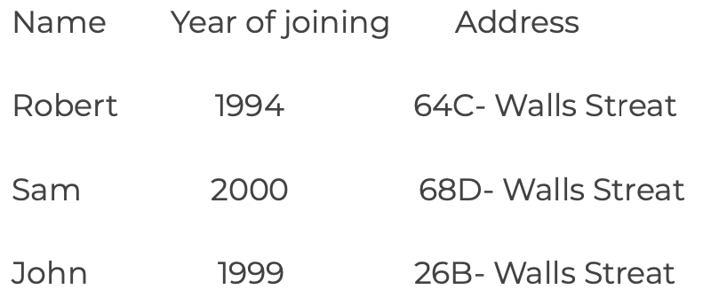

# Task 5: Classes and Objects

1. Print the sum, difference and product of two complex numbers by creating a class named 'Complex' with separate methods for each operation whose real and imaginary parts are entered by user. 

2. Write a program that would print the information (name, year of joining, salary, address) of three employees by creating a class named 'Employee'. The output should be as follows: 

